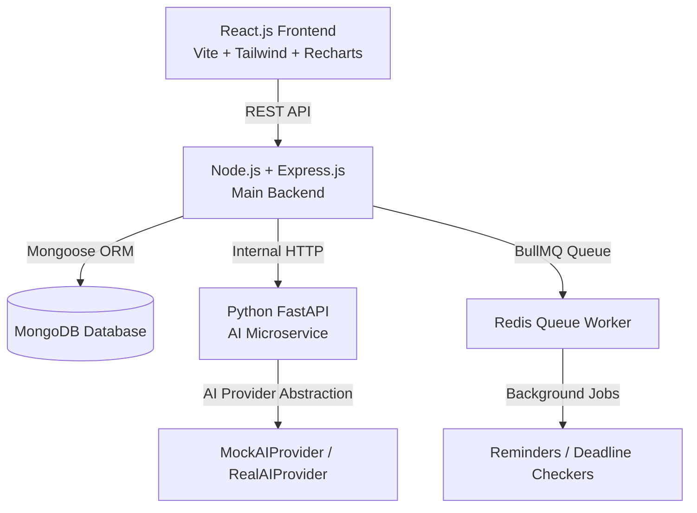

# COMMITGUARD — AI-Powered Accountability & Commitment Platform

> **Tagline:** *"Complete your commitment. Or pay the consequence."*


---

## 📌 Project Overview

**CommitGuard** is a full-stack AI-driven accountability platform engineered to bridge the gap between intention and action. Users create commitments with financial/social stakes. Upon task completion, proof (images or text logs) is submitted to an isolated **Python FastAPI AI Microservice** for visual and natural language verification.

If proof passes verification, streaks and progress analytics update. If a user misses their deadline without valid proof, an automated **Penalty Engine** executes a simulated transaction transferring the penalty stake to their designated **Accountability Partner** or **Charity Cause**.

---

## 🏗️ High-Level System Architecture



### Flow Diagram
1. **User Creates Commitment:** React Frontend $\rightarrow$ Express Backend $\rightarrow$ MongoDB & BullMQ Schedule.
2. **Proof Submission:** User uploads photo/text $\rightarrow$ Express saves to Local Storage $\rightarrow$ Express calls Python FastAPI `/verify/image`.
3. **Python AI Analysis:** Evaluates evidence consistency and confidence score. Returns `{ verified, confidence, reason, status }`.
4. **Completion:** If `verified === true` $\rightarrow$ Status set to `COMPLETED` $\rightarrow$ Streak updated $\rightarrow$ Notification created.
5. **Missed Deadline:** If deadline passes $\rightarrow$ Background worker marks `MISSED` $\rightarrow$ Penalty created $\rightarrow$ `MockPaymentService` executes transaction $\rightarrow$ Notification & Buddy alert sent.

---

## 🛠️ Technology Stack

| Layer | Technologies Used |
| :--- | :--- |
| **Frontend** | React 18, TypeScript, Vite, Tailwind CSS, Recharts, Lucide React, React Hook Form, Zod, Axios |
| **Main Backend** | Node.js, Express.js, MongoDB, Mongoose, JWT, bcryptjs, Helmet, CORS, Express Rate Limit, Multer |
| **AI Microservice** | Python 3.10+, FastAPI, Pydantic, Uvicorn, Pillow, Pytest |
| **Background Jobs** | Redis, BullMQ (with fallback interval worker) |
| **DevOps & Testing** | Docker, Docker Compose, Jest, Supertest, Pytest |

---

## 📂 Monorepo Folder Structure

```text
Final-Project/
├── client/ (or frontend/)
│   ├── src/
│   │   ├── components/     # ProgressCard, StreakCard, TaskCard, Navbar, Sidebar
│   │   ├── context/        # AuthContext, ThemeContext
│   │   ├── layouts/        # AppLayout
│   │   ├── pages/          # Dashboard, Commitments, Analytics, Streaks, ProofUpload, etc.
│   │   ├── services/       # Axios API client with auth interceptor
│   │   ├── types/          # TypeScript interfaces
│   │   ├── App.tsx
│   │   └── main.tsx
│   ├── package.json
│   └── vite.config.ts
│
├── server/ (or backend/)
│   ├── src/
│   │   ├── config/         # Database connection with readyState check
│   │   ├── controllers/    # Auth, Commitment, Proof, Streak, Penalty, Demo controllers
│   │   ├── middleware/     # Auth JWT protection, ErrorHandler, Multer Upload
│   │   ├── models/         # Mongoose Schemas (User, Commitment, Streak, Penalty, etc.)
│   │   ├── routes/         # Express REST API routes
│   │   ├── services/       # AIService, PaymentService, PenaltyService, StorageService
│   │   ├── workers/        # BullMQ Queues and Worker Loop
│   │   ├── app.js
│   │   └── server.js
│   ├── tests/              # Jest + Supertest test suite
│   └── package.json
│
├── ai-service/
│   ├── app/
│   │   ├── config.py
│   │   ├── main.py         # FastAPI App
│   │   ├── routers/        # /verify/image, /verify/text, /health
│   │   ├── schemas/        # Pydantic verification request/response schemas
│   │   └── services/       # AIProvider interface, MockAIProvider, RealAIProvider
│   ├── tests/              # Pytest test suite
│   ├── requirements.txt
│   └── Dockerfile
│
├── docker-compose.yml
├── .env.example
├── README.md
└── .gitignore
```

---

## ⚡ Quick Start & Setup Guide

### 1. Environment Variables Configuration

Copy `.env.example` to creating local `.env` files in `backend`, `frontend`, and `ai-service`:

```bash
cp .env.example .env
```

### 2. Local Setup without Docker

#### Step A: Python AI Microservice
```bash
cd ai-service
python -m venv venv
.\venv\Scripts\activate  # On Windows
pip install -r requirements.txt
uvicorn app.main:app --port 8000 --reload
```

#### Step B: Express Backend
```bash
cd backend
npm install
npm run dev
```

#### Step C: React Frontend
```bash
cd frontend
npm install
npm run dev
```

Access application at `http://localhost:5173`.

---

## 🐳 Docker Deployment

To run all 5 microservices (MongoDB, Redis, Python AI, Node Backend, React Frontend) with one command:

```bash
docker compose up --build
```

---

## 🔑 Demo Credentials

| Role | Email | Password |
| :--- | :--- | :--- |
| **Demo User** | `demo@commitguard.com` | `Password123!` |

*You can also click the **"Log In with Sandbox Demo Account"** button on the Login page for instant one-click access.*

---

## 🧪 Testing Suite Execution

### Backend Tests (Jest + Supertest)
```bash
cd backend
npm test
```

### Python AI Service Tests (Pytest)
```bash
cd ai-service
$env:PYTHONPATH="." ; .\venv\Scripts\pytest
```

---

## 🔐 Security & Safety Features

- **Health / Medicine Safeguard:** For health and medicine commitments, the Python AI provider strictly verifies proof evidence consistency without claiming biological ingestion.
- **API Security:** Helmet HTTP headers, CORS domain whitelisting, Express rate-limiting (300 req/15min).
- **Password Protection:** Passwords hashed using `bcrypt` with 10 salt rounds. Plaintext passwords are never stored.
- **JWT Protection:** Short-lived JWTs stored securely in standard headers with auto-logout interceptors.
- **Idempotency Safeguard:** Prevents duplicate penalties from being generated for the same task.

---

## 📄 License
Distributed under the MIT License. Built for full-stack excellence.
